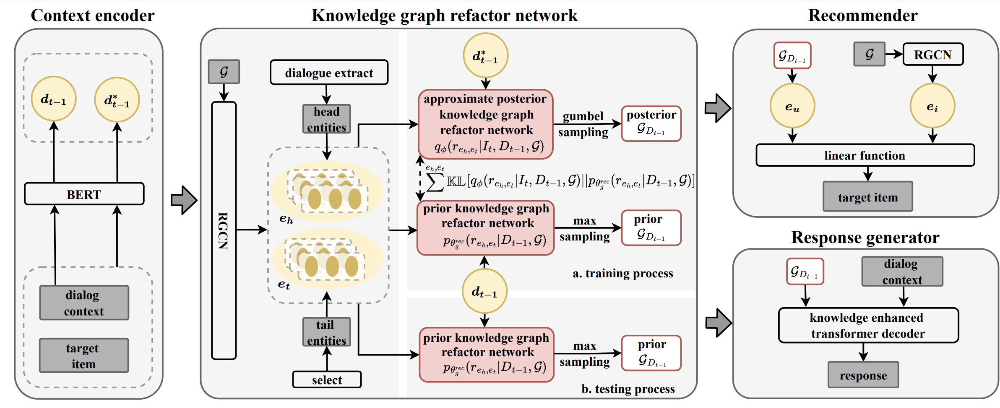

# VRICR： Variational Reasoning over Incomplete KGs Conversational Recommender
The source code for WSDM 2023 Paper "Variational Reasoning over Incomplete Knowledge Graphs for Conversational Recommendation"

## Overview
We propose Variational Reasoning over Incomplete KGs Conversational Recommender. Our key idea is to incorporate the large dialogue corpus naturally accompanied with CRS to enhance the incomplete knowledge graphs; and adopt the variational Bayesian method to perform dynamic knowledge reasoning conditioned on the dialogue context. Specifically, we introduce the ideal dialogue context-aware knowledge subgraphs as latent variables with categorical prior from the observed incomplete knowledge graphs and dialogue corpus. Then, we use variational reasoning to approximate the posterior distribution and obtain the enhanced knowledge subgraphs, which can not only leverage the dialogue corpus for restructuring the missing entity relations but also perform dynamic knowledge selection for recommendation based on the dialogue context.



## Saved Models
We have trained our model on two datasets and saved the parameters, all of which have been uploaded to [Google Drive](https://drive.google.com/drive/folders/1Ys3lz0nlnobTPoWUqlsmiVOeiRKGMW3p?usp=sharing).

The downloaded ckpt files should be moved into `data/ckpt`.

## Quick-Start
We run all experiments and tune hyperparameters on a RTX3090 with 24GB memory, you can adjust `train_batch_size` and `test_batch_size` according to your GPU, and then the optimization hyperparameters also need to be tuned.
```
sh script/redial/redial_rec_pretrain.sh
sh script/redial/redial_rec_finetune.sh # remember to change --task_ID and --best_ckpt_path_for_pretrain
sh script/redial/redial_conv.sh # remember to change --task_ID and --best_ckpt_path_for_rec_finetune

sh script/tgredial/train/redial_rec_pretrain.sh
sh script/tgredial/tgredial_rec_finetune.sh # remember to change --task_ID and --best_ckpt_path_for_pretrain
sh script/tgredial/tgredial_conv.sh # remember to change --task_ID and --best_ckpt_path_for_rec_finetune
```

You can also test the model has been saved by us.
```
sh script/redial/redial_rec_eval.sh
sh script/redial/redial_conv_eval.sh

sh script/tgredial/eval/tgredial_rec_eval.sh
sh script/tgredial/eval/tgredial_conv_eval.sh
```


## Contact
If you have any questions for our paper or codes, please send an email to xiaoyu.zhang@mail.sdu.edu.com.

## Acknowledgement
Our datasets and data process code are developed based on [C2-CRS](https://github.com/Zyh716/WSDM2022-C2CRS)

Any scientific publications that use our codes should cite our paper as the reference.